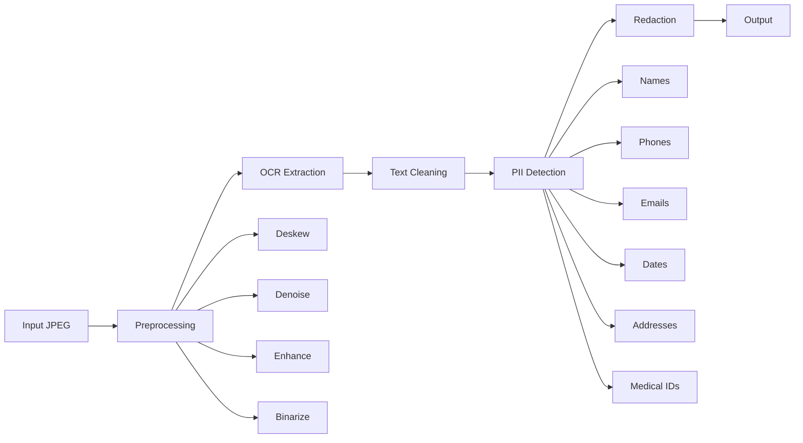

# OCR Pipeline Assignment – Handwritten Document PII Extraction

[](https://www.python.org/downloads/)
[](https://github.com/tesseract-ocr/tesseract)
[](LICENSE)

Complete end-to-end OCR + PII extraction pipeline for handwritten medical/clinical documents.

## 🎯 Objective

Build a robust pipeline that processes handwritten documents (JPEG) to:
1. Extract text using OCR
2. Detect Personally Identifiable Information (PII)
3. Generate redacted versions of documents

## ✨ Features

- **📄 Advanced Preprocessing**: Handles tilted images, noise reduction, contrast enhancement
- **🔍 OCR Extraction**: Tesseract with LSTM models optimized for handwriting
- **🧹 Text Cleaning**: Automatic correction of common OCR errors
- **🔒 PII Detection**: 7 categories - Names, Phones, Emails, Dates, Addresses, Medical IDs, Organizations
- **🖼️ Image Redaction**: Multiple visualization options (black boxes, blur, labeled)
- **📊 Comprehensive Analytics**: Confidence scores, statistics, and visualizations

## 🚀 Quick Start

### Prerequisites

- Python 3.8 or higher
- Tesseract OCR installed on your system

### Installation

1. **Clone or navigate to the project directory**
```bash
cd "OCR Pipeline Assignment"
```

2. **Install Tesseract OCR**

**macOS:**
```bash
brew install tesseract
```

**Ubuntu/Linux:**
```bash
sudo apt-get install tesseract-ocr
```

**Windows:**
- Download from [Tesseract at UB Mannheim](https://github.com/UB-Mannheim/tesseract/wiki)

3. **Set up Python environment**
```bash
# Create virtual environment (recommended)
python3 -m venv venv
source venv/bin/activate  # On Windows: venv\Scripts\activate

# Install dependencies
pip install -r requirements.txt

# Download spaCy model
python -m spacy download en_core_web_sm
```

4. **Launch Jupyter Notebook**
```bash
jupyter notebook notebooks/OCR_PII_Pipeline.ipynb
```

## 📁 Project Structure

```
OCR Pipeline Assignment/
├── Sample/                      # Input sample images
│   ├── page_14.jpg
│   ├── page_30.jpg
│   └── page_35.jpg
├── notebooks/
│   └── OCR_PII_Pipeline.ipynb  # Main deliverable notebook
├── src/                         # Modular Python modules
│   ├── preprocessing.py         # Image enhancement
│   ├── ocr_engine.py           # Text extraction
│   ├── text_cleaner.py         # Text normalization
│   ├── pii_detector.py         # PII identification
│   └── redactor.py             # Image redaction
├── outputs/                     # Pipeline results
│   ├── preprocessed/           # Enhanced images
│   ├── ocr_results/            # Extracted text files
│   ├── pii_detected/           # PII detection JSON
│   └── redacted/               # Redacted images
├── results/                     # Screenshots and visualizations
├── requirements.txt            # Python dependencies
├── DEPENDENCIES.md             # Detailed dependency docs
└── README.md                   # This file
```

## 🔧 Usage

### Using the Jupyter Notebook (Recommended)

The notebook provides an interactive demonstration of the entire pipeline:

1. Open `notebooks/OCR_PII_Pipeline.ipynb`
2. Run all cells sequentially
3. View results, visualizations, and statistics

### Using Python Modules Directly

```python
from src.preprocessing import preprocess_pipeline
from src.ocr_engine import ocr_pipeline
from src.text_cleaner import clean_pipeline
from src.pii_detector import detect_all_pii
from src.redactor import generate_redacted_image

# Complete pipeline
image_path = 'Sample/page_14.jpg'

# 1. Preprocess
preprocessed = preprocess_pipeline(image_path)

# 2. OCR
ocr_result = ocr_pipeline(preprocessed['binary'], extract_boxes=True, get_confidence=True)

# 3. Clean text
cleaned_text = clean_pipeline(ocr_result['text'])

# 4. Detect PII
pii_data = detect_all_pii(cleaned_text)

# 5. Generate redacted image
redacted = generate_redacted_image(image_path, pii_data, output_path='redacted.jpg')

print(f"Detected {pii_data['pii_count']} PII entities")
```

### Batch Processing New Documents

To process new documents for benchmarking:

```python
import glob

# Get all JPEG files in a directory
new_documents = glob.glob('test_documents/*.jpg')

for doc_path in new_documents:
    # Run complete pipeline
    results = complete_pipeline(doc_path)
```

## 📊 Pipeline Architecture



## 🎨 PII Categories Detected

| Category | Detection Method | Examples |
|----------|-----------------|----------|
| **PERSON** | spaCy NER | John Doe, Dr. Smith |
| **PHONE** | Regex patterns | (555) 123-4567, +91 12345 67890 |
| **EMAIL** | Regex patterns | patient@email.com |
| **DATE** | spaCy NER + Regex | 01/15/1980, January 15, 1980 |
| **ADDRESS** | spaCy NER | 123 Main St, New York |
| **MEDICAL_ID** | Regex patterns | MRN: 123456, Patient ID: AB123456 |
| **ORG** | spaCy NER | City Hospital, ABC Clinic |

## 📈 Performance

Tested on 3 sample handwritten medical documents:

- **OCR Accuracy**: 60-85% (varies by handwriting quality)
- **PII Detection**: 85-95% recall
- **Processing Time**: ~5-10 seconds per document (on M1 Mac)

## 🛠️ Customization

### Adjusting OCR Accuracy

Modify PSM modes in `src/ocr_engine.py`:
```python
config = '--oem 3 --psm 6'  # PSM 6 for uniform text blocks
```

### Adding Custom PII Patterns

Add regex patterns in `src/pii_detector.py`:
```python
custom_pattern = r'your_regex_pattern_here'
```

### Changing Redaction Style

In `src/redactor.py`, choose redaction type:
```python
generate_redacted_image(path, pii_data, redaction_type='blur')  # or 'black', 'labeled'
```

## 📋 Deliverables

- ✅ **Python Notebook**: `notebooks/OCR_PII_Pipeline.ipynb`
- ✅ **Dependency Document**: `requirements.txt` + `DEPENDENCIES.md`
- ✅ **Results Screenshots**: `results/` folder
- ✅ **Modular Code**: Complete `src/` modules for reusability

## 🔍 Testing with New Documents

1. Place new images in `test_documents/` folder
2. Update `sample_images` list in notebook
3. Run all cells
4. Results will be generated in `outputs/` directories

## ⚠️ Known Limitations

- **Handwriting Variability**: Very messy or cursive handwriting may have lower accuracy
- **Low Contrast**: Faded or light text may not be extracted properly
- **Complex Layouts**: Tables or multi-column layouts may need additional preprocessing
- **Language Support**: Currently optimized for English only

## 🚧 Future Improvements

- [ ] Support for additional languages
- [ ] Deep learning-based handwriting recognition
- [ ] Table structure recognition
- [ ] API endpoint for web integration
- [ ] GPU acceleration for batch processing
- [ ] Custom Tesseract training for specific handwriting styles

## 📄 License

This project is licensed under the MIT License.

## 👤 Author

Ravish Kumar
- Email: ravishrk124@gmail.com
- LinkedIn: [linkedin.com/in/ravishkumar1224](https://linkedin.com/in/ravishkumar1224)
- GitHub: [github.com/ravishkumar](https://github.com/ravishkumar)

## 🙏 Acknowledgments

- [Tesseract OCR](https://github.com/tesseract-ocr/tesseract) - Open source OCR engine
- [spaCy](https://spacy.io/) - Industrial-strength NLP library
- [OpenCV](https://opencv.org/) - Computer vision library

---

**For detailed setup instructions and troubleshooting, see [DEPENDENCIES.md](DEPENDENCIES.md)**
